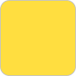

# Цвета

### Основные цвета

| Белый | Жёлтый | Чёрный | Тёмно-серый |
| :--- | :--- | :--- | :--- |
| \#FFFFFF | \#ffde40 | \#222222 | \#70747F |
| CMYK 0 0 0 0 | CMYK 0 10 85 0 | CMYK 60 40 40 100 | CMYK 20 10 0 65 |
| Oracal 010 | Oracal 021 | Oracal 070 | — |

### Дополнительные цвета

| Светло-серый | Красный | Светло-синий |
| :--- | :--- | :--- |
| \#EBEBEB | \#EA503F | \#237DC6 |
| CMYK 0 0 0 20 | CMYK 0 80 73 0 | CMYK 90 60 00 00 |

