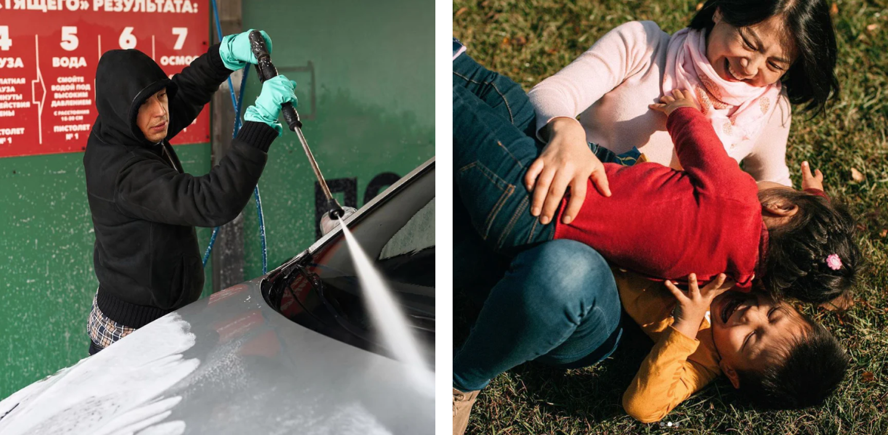

# Фотостиль

* ** City ** - the working space of the driver.
* ** Close ** - a component that drives drivers. This is not about business, it's about emotions.
* ** Road ** - constant dynamics, a sense of freedom.
* ** Devotion ** - love for difficult work.

## Сюжеты

### Портрет

В центре кадра водитель-профессионал. Мы передаем характер героя и фокусируемся на его уникальных качествах. Мелочи имеют значение — они раскрывают историю нашего героя.

### История

Показываем реальность такой, какая она есть — ничего не подстраиваем. Это «застывший» момент. В кадре есть динамика, понятен главный герой и контекст.

Каждый день водителя насыщен разными событиями. Самые яркие и интересные мы фиксируем, потому что это нас вдохновляет.

### Детали

То, что окружает и наполняет жизнь водителя: архитектура города, дорога, части автомобиля. Всё это неотъемлемые атрибуты жизни водителя.

\*Для иллюстрации некоторых примеров были использованы фотографии [Александра Гронского](https://www.alexandergronsky.com/) и [Глеба Леонова](https://www.instagram.com/eble__onov/)

