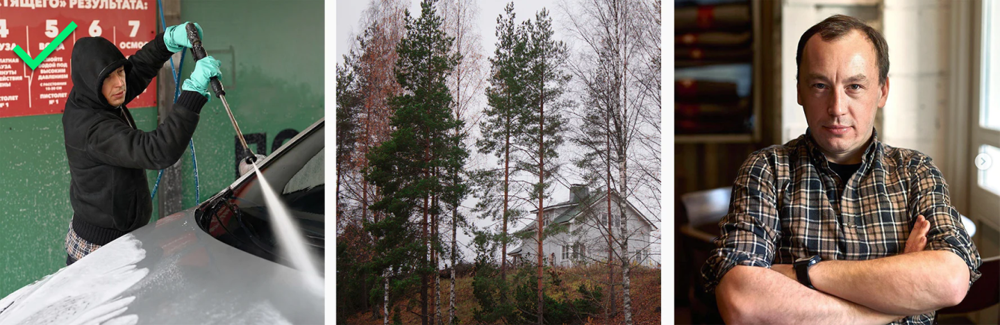
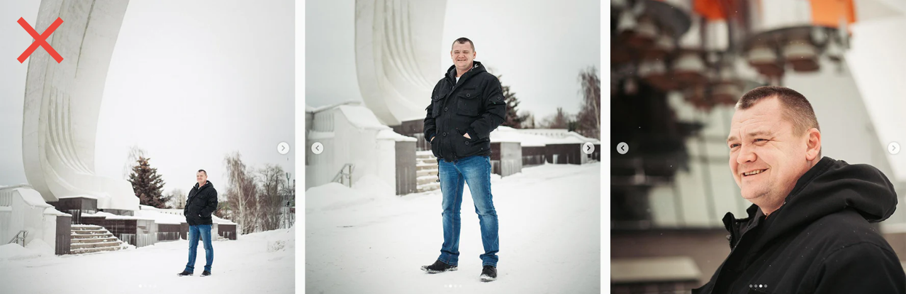

# Инстаграм

### Лента

Сохраняйте ритм и избавляйтесь от монотонности, повторений. Если чередовать изображения людей с деталями города, автомобилями получится больше воздуха. Так мы сможем объединить контент в одну большую историю, от которой трудно оторваться.




Постарайтесь рассказать историю через разные планы. Сюжет не обязательно должен совпадать с текстом.



Избегайте похожих сюжетов и планов


