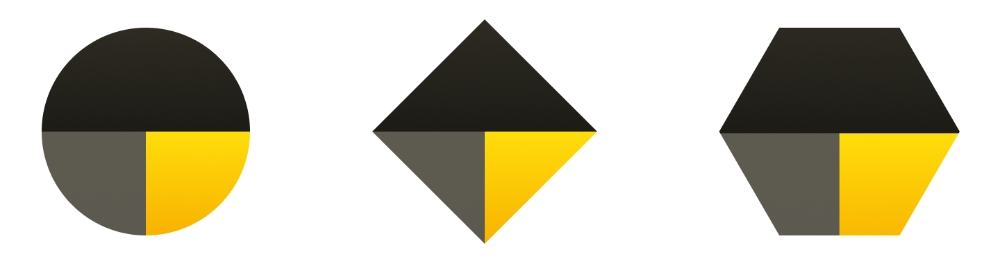
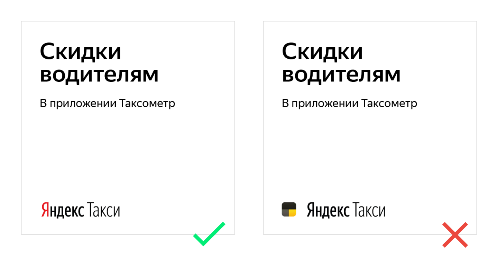

# Иконка приложения

Иконка Яндекс.Такси — три блока, собранных в пропорции 1:2

Иконка без градиента — для случаев, когда трудно передать малейшие цветовые оттенки. Например, для печати или уменьшенной версии.

### Форма иконки

Иконка меняет форму в зависимости от ситуации. Иконка подстраивается под устройство: например, для Android она круглая.

### Иконка + логотип

Иконка и логотип — разные вещи. Не используйте их в одном блоке.

