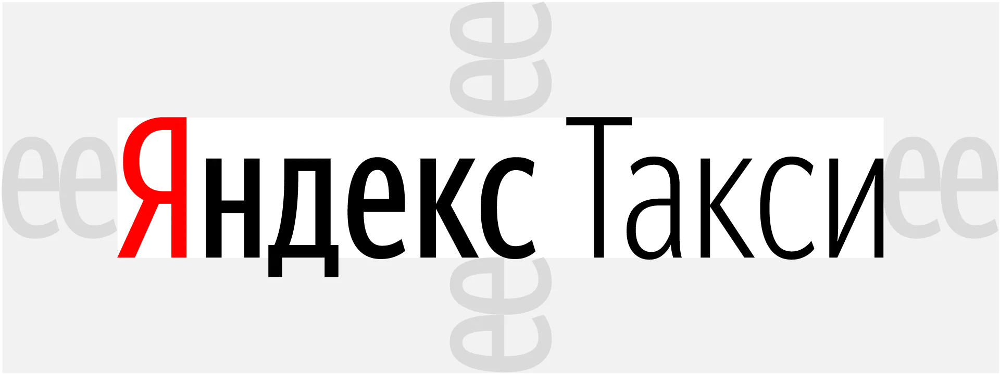
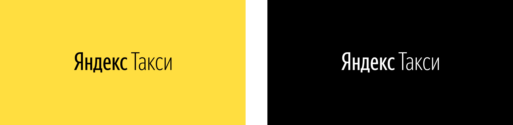
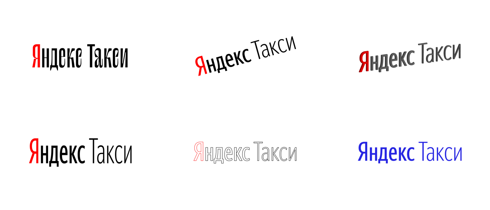

# Логотип

[Скачать логотип ↗](https://disk.yandex.ru/client/disk/CREATIVE/!YTD_GUIDES/Fonts/YS%2520Text)

### Охранное поле

Охранное поле логотипа — ширина двух букв «е» этого логотипа. В охранном поле нельзя размещать изображения и текст.

### Логотип на фоне

Буква «Я» выделяется красным, если логотип Яндекс.Такси располагается на белом фоне.

На светлых цветных фонах размещайте чёрный логотип. Буква «Я» не выделяется красным.

На тёмных цветных фонах размещайте белый логотип. Буква «Я» не выделяется красным.


Буква «Я» выделяется красным на жёлтом фоне только на фирменной оклейке автомобиля.


### Примеры неверного использования


Не изменяйте шрифт

Не изменяйте наклон

Не делайте логотип объемным

Не искажайте пропорции

Не используйте обводку

Не меняйте цвет логотипа. Разрешённые цвета перечислены в этом руководстве


