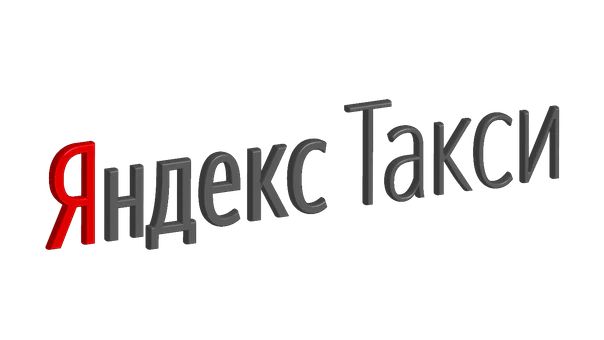

# Логотип

[Скачать логотип ↗](https://disk.yandex.ru/client/disk/CREATIVE/!YTD_GUIDES/Fonts/YS%2520Text)

### Охранное поле

Охранное поле логотипа — ширина двух букв «е» этого логотипа. В охранном поле нельзя размещать изображения и текст.

### Логотип на фоне

![&#x411;&#x443;&#x43A;&#x432;&#x430; &#xAB;&#x42F;&#xBB; &#x432;&#x44B;&#x434;&#x435;&#x43B;&#x44F;&#x435;&#x442;&#x441;&#x44F; &#x43A;&#x440;&#x430;&#x441;&#x43D;&#x44B;&#x43C;, &#x435;&#x441;&#x43B;&#x438; &#x43B;&#x43E;&#x433;&#x43E;&#x442;&#x438;&#x43F; &#x42F;&#x43D;&#x434;&#x435;&#x43A;&#x441;.&#x422;&#x430;&#x43A;&#x441;&#x438; &#x440;&#x430;&#x441;&#x43F;&#x43E;&#x43B;&#x430;&#x433;&#x430;&#x435;&#x442;&#x441;&#x44F; &#x43D;&#x430; &#x431;&#x435;&#x43B;&#x43E;&#x43C; &#x444;&#x43E;&#x43D;&#x435;.](.gitbook/assets/yly.png)

![&#x41D;&#x430; &#x441;&#x432;&#x435;&#x442;&#x43B;&#x44B;&#x445; &#x446;&#x432;&#x435;&#x442;&#x43D;&#x44B;&#x445; &#x444;&#x43E;&#x43D;&#x430;&#x445; &#x440;&#x430;&#x437;&#x43C;&#x435;&#x449;&#x430;&#x439;&#x442;&#x435; &#x447;&#x451;&#x440;&#x43D;&#x44B;&#x439; &#x43B;&#x43E;&#x433;&#x43E;&#x442;&#x438;&#x43F;. &#x411;&#x443;&#x43A;&#x432;&#x430; &#xAB;&#x42F;&#xBB; &#x43D;&#x435; &#x432;&#x44B;&#x434;&#x435;&#x43B;&#x44F;&#x435;&#x442;&#x441;&#x44F; &#x43A;&#x440;&#x430;&#x441;&#x43D;&#x44B;&#x43C;.](.gitbook/assets/ylw.png)

### Примеры неверного использования

