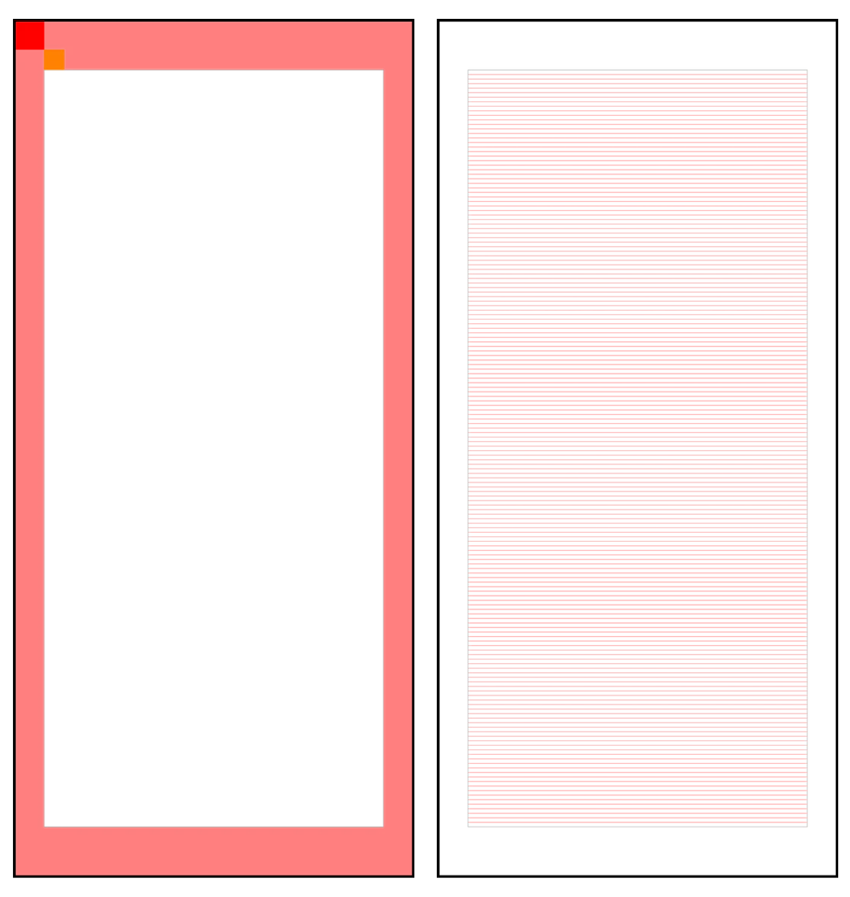

# Пиллар

Пиллар — высокий вертикальный информационный носитель \(1400 х 3000 мм\). Не рекомендуется помещать заголовки и важную информацию наверху макета — её сложно считывать на большой высоте.

### Технические требования

1. Ключевая информация должна размещаться минимум на 100 мм от краёв;
2. Минимальная высота шрифта — 22 мм.

### Размер логотипа и модуль

Размер логотипа Яндекс.Такси измеряется по высоте прописной буквы «Я». В пилларах она равна 30 пт. Соответственно, для пиллара модуль — это квадрат со стороной 30 пт.


Обратите внимание, все значения будут приводиться в масштабе 1:10.


### Построение сетки

1. Чтобы построить поля, используйте расстояние равное одному модулю по бокам и 1⅔ модуля сверху и снизу. В полученное поле не должны попадать основной текст, дисклеймер и логотип.
2. Настройте базовую сетку. Выберите выстраивание сетки относительно верхнего поля отступа. Шаг сетки должен быть равен 6 пт.

### Иерархия стилей

В таблице представлены настройки стилей текста пиллара для InDesign.

| Стиль текста | Заголовок | Подзаголовок | Телефон | Дисклеймер |
| :--- | :--- | :--- | :--- | :--- |
| Шрифт | YS Text Medium | YS Text Regular | YS Text Medium | Noto Sans EСL |
| Кегль | 48 пт | 24 пт | 36 пт | 12 пт |
| Интерлиньяж | 54 пт | \(28,8\) auto | 42 пт | 12 пт |
| Трекинг | -5 | 0 | -5 | 0 |
| Отступ | — | — | — | — |
| Выравнивание | по базовой | по базовой | по базовой | по базовой |

### Шаблоны

[Скачать шаблоны↗](https://disk.yandex.ru/client/disk/CREATIVE/!YTD_GUIDES/Templates/Outdoor)

