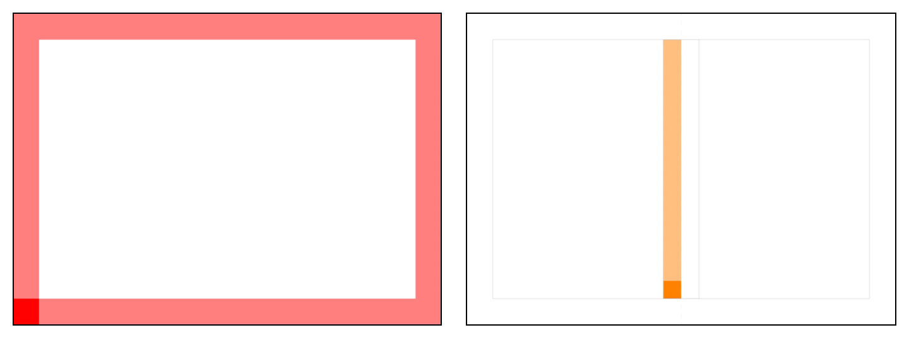

# Ситиборд

Ситиборд — это крупный информационный носитель \(3700 х 2700 мм\). Его особенности — минимум текста, максимум содержания. И пешеходы, и автомобилисты должны считывать сообщение с расстояния в несколько десятков метров.

### Технические требования

1. Ключевая информация должна размещаться минимум на 200 мм от краёв;
2. Минимальная высота шрифта — 30 мм.

### Размер логотипа и модуль

Размер логотипа Яндекс.Такси измеряется по высоте прописной буквы «Я». В билбордах она равна 66 пт. Соответственно, для билборда модуль — это квадрат со стороной 66 пт.


Обратите внимание, все значения будут приводиться в масштабе 1:10.


### Построение сетки

1. Оставляйте поля на расстоянии, кратном одному модулю. Отступы должны быть одинаковыми со всех сторон. В полученное поле не должны попадать основной текст, дисклеймер и логотип.
2. Разделите получившуюся область на две колонки. Расстояние между ними должно быть равно 88 пт \(1⅓ модуля\).
3. Настройте базовую сетку. Выберите выстраивание сетки относительно верхнего поля отступа. Шаг сетки должен быть равен 6 пт.

### Иерархия стилей

В таблице представлены настройки стилей текста ситиборда для InDesign.

| Стиль текста | Заголовок | Подзаголовок | Телефон | Дисклеймер |
| :--- | :--- | :--- | :--- | :--- |
| Шрифт | YS Text Medium | YS Text Regular | YS Text Medium | Noto Sans EСL |
| Кегль | 78 пт | 39 пт | 56 пт | 18 пт |
| Интерлиньяж | 78 пт | \(46,8\) auto | 56 пт | 18 пт |
| Трекинг | -5 | 0 | -5 | 0 |
| Отступ | — | — | — | — |
| Выравнивание | по базовой | по базовой | по базовой | по базовой |

### Шаблоны

[Скачать шаблоны↗](https://disk.yandex.ru/client/disk/CREATIVE/!YTD_GUIDES/Templates/Outdoor)

