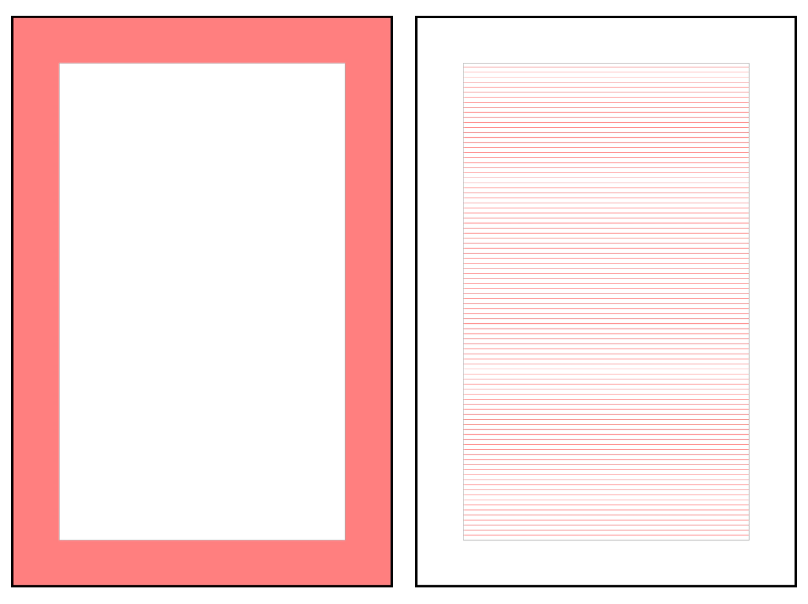

# Ситиформат

Ситиформат — наружная реклама \(1200 х 1800 мм\). Особенности — минимум текста, максимум содержания. Сообщение должно считываться с расстояния в несколько десятков метров и пешеходами, и водителями.

### Технические требования

1. Ключевая информация должна размещаться минимум на 150 мм от краёв;
2. Минимальная высота шрифта — 22 мм.

### Размер логотипа и модуль

Размер логотипа Яндекс.Такси измеряется по высоте прописной буквы «Я». В билбордах она равна 24 пт. Соответственно, для билборда модуль — это квадрат со стороной 24 пт.


Обратите внимание, все значения будут приводиться в масштабе 1:10.


### Построение сетки

1. Чтобы построить поля, сделайте отступы по 15 мм. Отступы одинаковы со всех четырёх сторон. В полученное поле не должны попадать основной текст, дисклеймер и логотип.
2. Настройте базовую сетку. Выберите выстраивание сетки относительно верхнего поля отступа. Шаг сетки должен быть равен 6 пт. 

### Иерархия стилей

В таблице представлены настройки стилей текста ситиформата для InDesign.

| Стиль текста | Заголовок | Подзаголовок | Телефон | Дисклеймер |
| :--- | :--- | :--- | :--- | :--- |
| Шрифт | YS Text Medium | YS Text Regular | YS Text Medium | Noto Sans EСL |
| Кегль | 33 пт | 15 пт | 27 пт | 12 пт |
| Интерлиньяж | 36 пт | \(18\) auto | 37 пт | 12 пт |
| Трекинг | -5 | 0 | -5 | 0 |
| Отступ | — | — | — | — |
| Выравнивание | по базовой | по базовой | по базовой | по базовой |

### Шаблоны

[Скачать шаблоны↗](https://disk.yandex.ru/client/disk/CREATIVE/!YTD_GUIDES/Templates/Outdoor)

