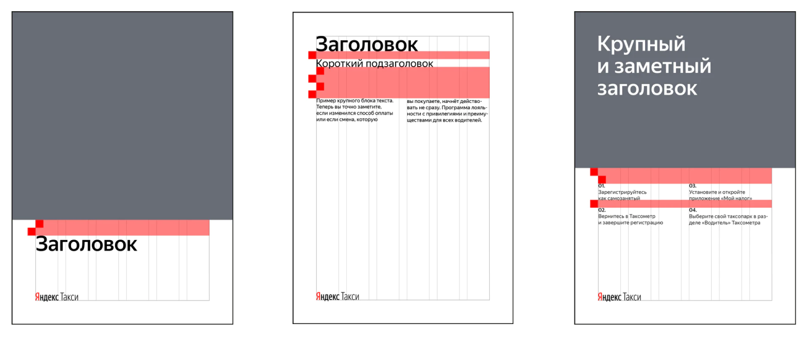

# Печатные материалы

1. Сначала нужно выбрать формат макета, потому что размер логотипа зависит от него.
2. Логотип задаёт размер модуля.
3. Все отступы и элементы вёрстки определяются модулем.

### Модуль

Модуль — это квадратный элемент, сторона которого равняется высоте прописной буквы «Я» в логотипе Яндекс.Такси. Все величины в макете, за исключением цветовых блоков, рассчитываются из размера модуля.

### Расположение логотипа

1. Логотип Яндекс.Такси всегда выравнивается по левому или правому отступу от края макета.
2. Если сверху расположен заголовок, то логотип размещается по нижней линии отступа от края макета.
3. Дисклеймер размещается по нижней линии отступа от края листа. Логотип должен быть выше дисклеймера и отделяться от него одним модулем.

### Отступы в макете

1. Стандартный размер отступа текста от цветового блока — два модуля.
2. Расстояние между элементами макета всегда кратно модулю. Нельзя делать разрывы больше четырёх модулей.
3. Отступы между пунктами списков всегда равны одному модулю.

### Телефоны, ссылки и дисклеймеры

1. Номера телефонов, ссылки на сайты и дисклеймеры оформляются отдельным стилем. У каждого формата свой стиль.
2. Пример оформления номеров телефонов: + 7 ХХХ ХХХ-ХХ-ХХ. Если код города набирать необязательно, он помещается в скобки: +7 \(ХХХ\) ХХХ-ХХ-ХХ.
3. Адреса сайтов пишутся без приставок http и www. Пример: driver.yandex.
4. Номер телефона и ссылка на сайт располагаются в углу макета или блока, чтобы уравновесить композицию. Если в макете есть дисклеймер, то между ним и номером телефона или ссылкой на сайт нужно сделать отступ в один модуль.
5. Дисклеймер всегда располагается на нижнем отступе от края листа и выравнивается по формату или по левому краю.

