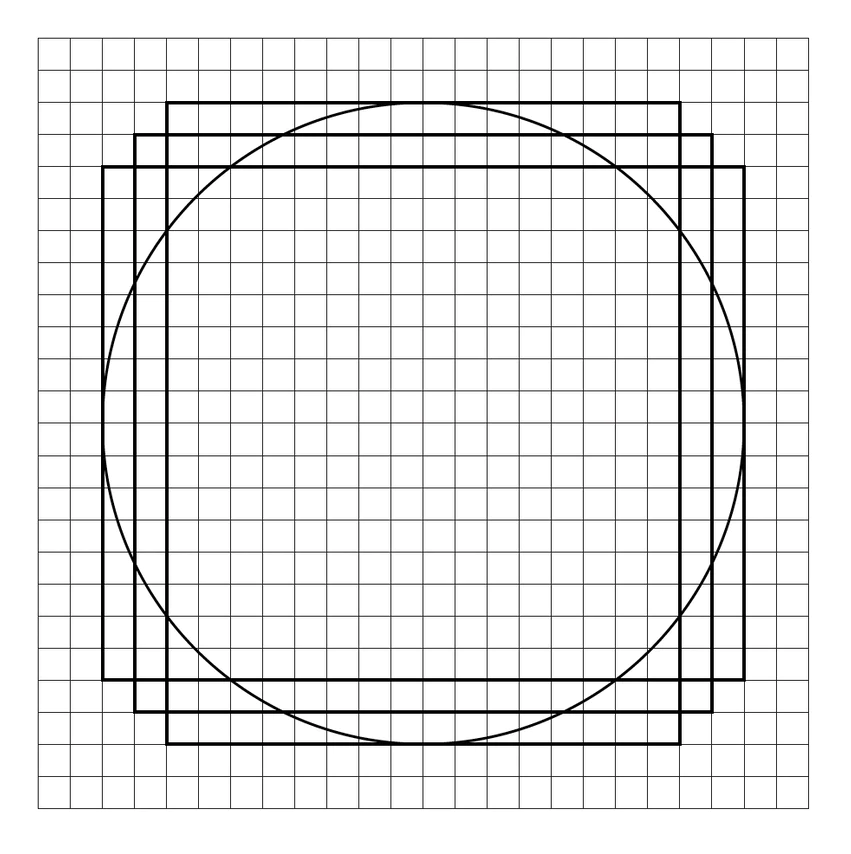
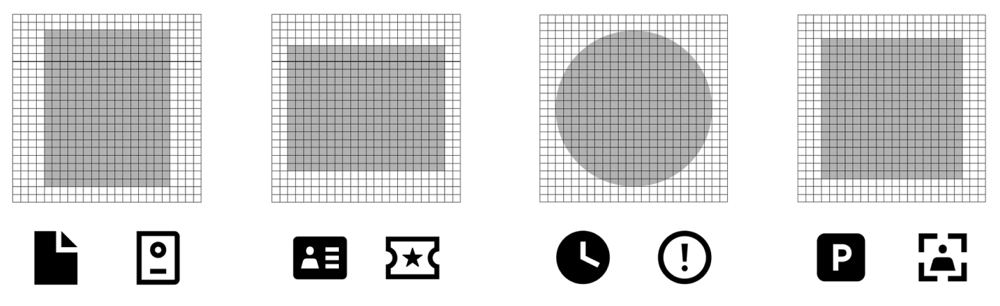
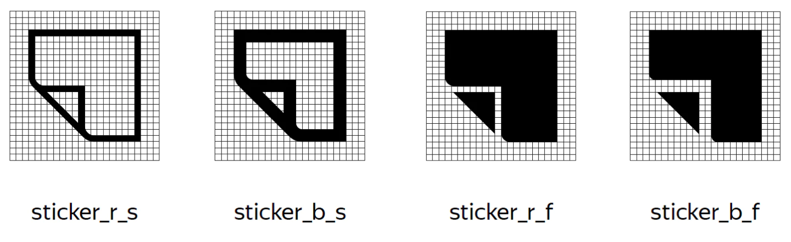
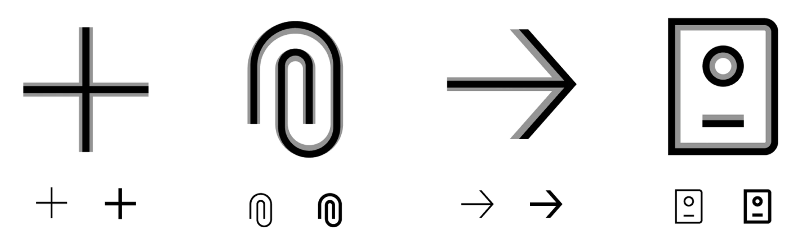

# Пиктограммы

Стиль наших иконок тесно связан с типографикой Yandex Sans. Это позволяет Яндекс.Такси выделяться и при этом сохранять преемственность Яндекса, оставаться узнаваемыми. Эти иконки можно использовать во всех коммуникациях — от продукта до маркетинга.

### Сетка

Все пиктограммы укладываются в сетку 24×24 модуля.

### Базовые фигуры

Иконки создаются на базе соразмерных примитивов: квадрата, круга и прямоугольника.

### Стили и начертания

Существует 2 уровня плотности — Bold и Regular. Каждый в двух стилях — Stroke и Fill. Они обозначены в конце названия файла:

* r\_s — нормальное линией;
* b\_s — жирное начертание линией;
* r\_f — нормальное заливкой.
* b\_f — жирное заливкой;

Ширина оптического штриха в Bold — 2 модуля, в Regular — 1.

### Интерполяция

Изменение насыщенности происходит внутрь объекта, чтобы его физический размер не менялся. Если линия находится на оси, интерполяция происходит от оси. Если же интерполированное начертание теряет узнаваемость, допустимо менять пропорции и рисунок.

### Метафора

Знак должен быть понятным и узнаваемым, а также — гармонично вписываться в общую экосистему Яндекса. Чтобы понять, какие ассоциации есть у пользователей, введите в поисковую строку название иконки. Также, можно проверять это на профильных ресурсах: [thenounproject.com](http://thenounproject.com/) или [iconfinder.com](http://iconfinder.com/). Не все знаки являются общепринятыми. В таком случае важно визуально передать его суть.

