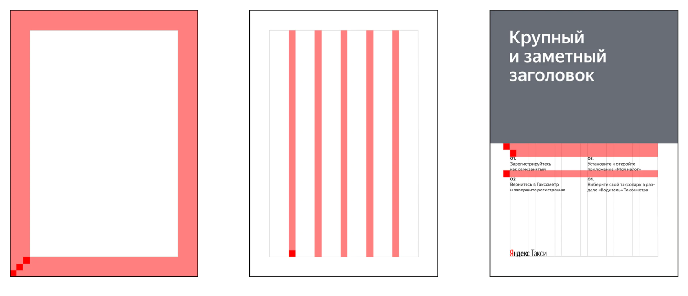
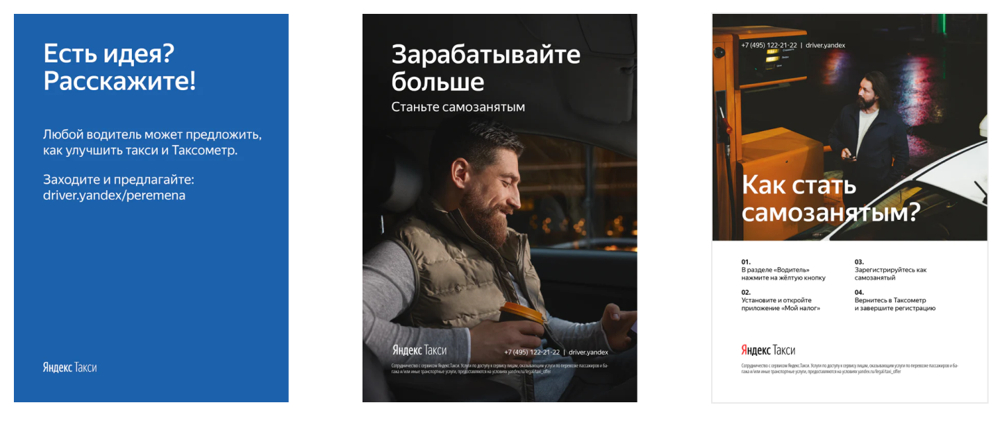
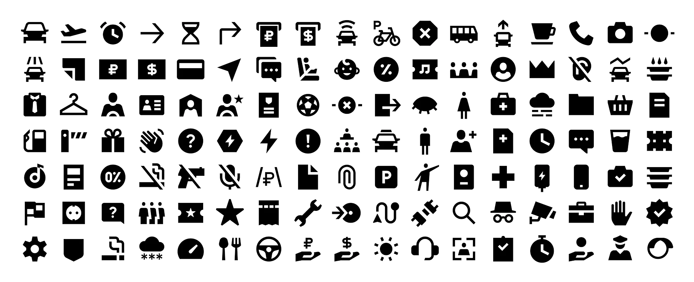
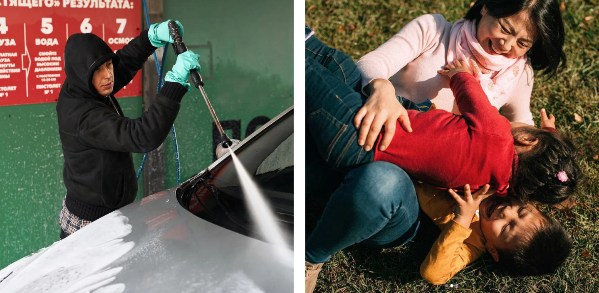

# Процесс создания

### Для чего нужны гайды и шаблоны?

Чтобы бренд ощущался зрелым, его составляющие должны быть консистентными. Стали бы вы доверять крупной компании, у которой бардак в визуальной коммуникации? Представим, что в хабе для водителей должны висеть рядом три плаката: один из них сверстали полгода назад подрядчики, второй сделали сотрудники хаба, над третьим работала креативная студия. Чтобы эти плакаты не выглядели, как карты из разных колод, нужны гайды и шаблоны. Они могут применяться не только к плакатам, но и к иллюстрациям, фотографиям, лендингам и многому другому.

Шаблоны экономят время: не нужно высчитывать отступы, искать размеры шрифта, подбирать фотографии, спорить о величине заголовка или логотипа. Можно сконцентрироваться на содержании, а не на форме.

### Почему общих гайдлайнов Такси недостаточно?

В конце 2017 года в Яндекс.Такси сформировался новый визуальный язык. Он отлично прижился и до сих пор работает в пользовательской коммуникации. Однако, не все приёмы так же хороши в общении с водителями. Про особенности водительского восприятия можно почитать на канале Driver surveys. Поэтому мы составили новую коммуникационную стратегию специально для водителей. Она касается не только текстов и посылов, но в целом выстраивает совершенно новую парадигму взаимоотношений. Естественно, новый подход должен поддерживаться и визуально.

### Процесс

Мы взяли за основу брендбук визуального языка Яндекс.Такси и начали его детализировать «в бою». Например, прежде чем передать шаблон подрядчикам, делали внутри креативной студии несколько макетов и проверяли их на работоспособность. В итоге у нас получился рабочий гайд с шаблонами.

### Вёрстка

Для начала нужно было разобраться во всех макетах, когда-либо сделанных в Яндекс.Такси. Мы просмотрели все наши раздаточные материалы и поняли, что имеем необоснованно много форматов. Мы выделили три основных: плакат А1, листовка А5, брошюра А6. Это самые распространённые форматы. К ним позже добавили стандартные форматы наружной рекламы: билборд, ситиборд, пиллар, ситиформат.

Затем мы сформулировали требования к контенту для каждого формата: где нужна только ёмкая фраза из четырёх слов, а где можно выстроить последовательное повествование.Последним этапом мы систематизировали все элементы: логотипы, заголовки, фотографии, блоки текста, номера телефонов и т.д. Для каждого элемента был задан размер, отступы и правила расположения в макете.

Последним этапом мы систематизировали все элементы: логотипы, заголовки, фотографии, блоки текста, номера телефонов и т.д. Для каждого элемента был задан размер, отступы и правила расположения в макете.

### Пиктограммы

Следом мы создали новый пак пиктограмм в четырёх начертаниях. Их стиль тесно связан с типографикой Yandex Sans. Это позволяет выделяться из общей массы и при этом сохранять преемственность Яндекса, оставаться узнаваемыми. Пиктограммы можно легко использовать во всех коммуникациях — от продукта до маркетинга.

### Фотостиль

Новая коммуникационная стратегия требует и нового фотостиля. Мы хотим строить доверительные отношения с водителями и поставили цель уходить от рекламных образов и проводить меньше съёмок с актёрами. Водители сразу чувствуют, когда их пытаются обмануть, поэтому мы решили не конструировать реальность и не создавать образы с нуля: теперь мы снимаем истории из жизни водителей и про водителей.

Фотостиль помогает оптимизировать работу: мы отдаём документ фотографу, и он сразу понимает, что нужно сделать. В SMM, к примеру, такой подход уже позволяет снимать дешевле и чаще. Сейчас мы думаем над тем, как это поставить на поток. Решили начать со смыслов: переписали правила фотостиля, сделав акцент на эмоциях. В итоге, получилось четыре константы — что мы обязательно показываем в фотографии:

1. Город — рабочее пространство водителя.
2. Близкие — составляющая, которая движет водителями выходить на линию и зарабатывать деньги. Это не про бизнес, это про эмоции.
3. Дорога — постоянная динамика, чувство свободы.
4. Преданность делу — любовь к непростому труду.

Ещё мы описали основные сюжеты, рекомендации ко всем этапам производства — теперь это полноценная база знаний. Сейчас мы внедряем наш фотостиль в SMM: тестируем и допиливаем наши гайдлайны.

### Что будем делать дальше

Впереди ещё много работы, сейчас мы: 

1. дорабатываем стиль иллюстраций водительского направления;
2. обновляем шаблоны по моушену;
3. тестируем новый подход к съемкам.
4. приводим шаблоны в Фигме в порядок.

### Над гайдами работали:

* Даниил Суховской
* Саша Вотинов
* Елизавета Довжик
* Снежанна Величко
* Кирилл Кириллов
* Владимир Куликов

