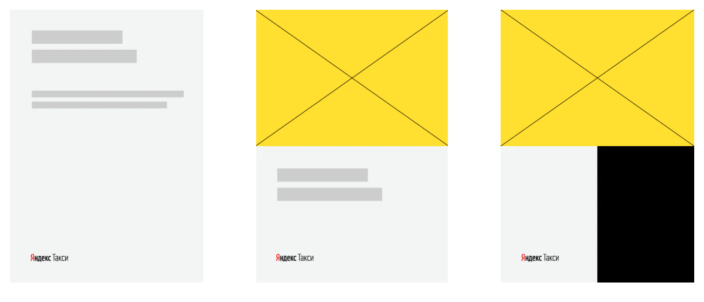

# Пропорции цветных блоков

Чтобы правильно разместить блок с изображением, разбейте макет с помощью сетки. Должно получиться 12 х 12 частей. Высота блока должна быть не менее 6 и не более 8 частей.

Не обязательно делить макет на три блока. Размещайте их в зависимости от вашей задачи: какой смысл хотите передать и что выделить.

